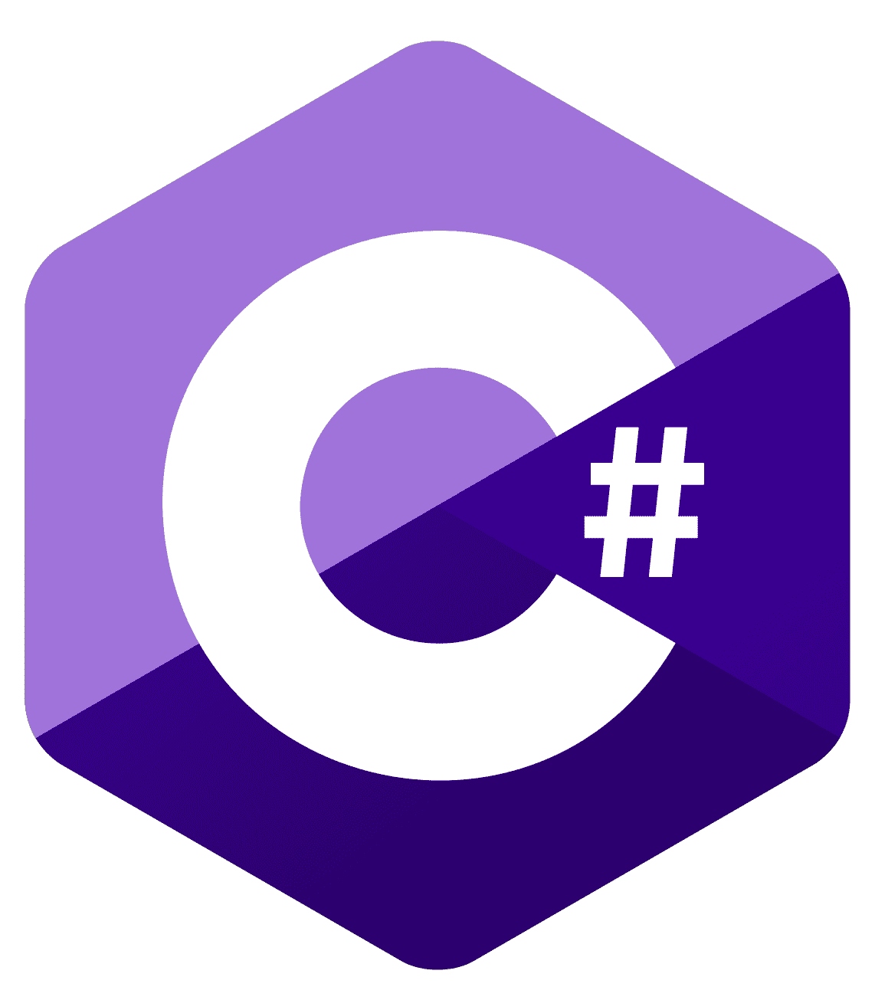

# Tera - Orders Management 📦💻

`Tera` is a web application where you can create a shopping list and it'll show the total purchase price.

Users will be able to add anything they need to `Tera` and buy it later without missing a thing.

---

**Technologies used:**

